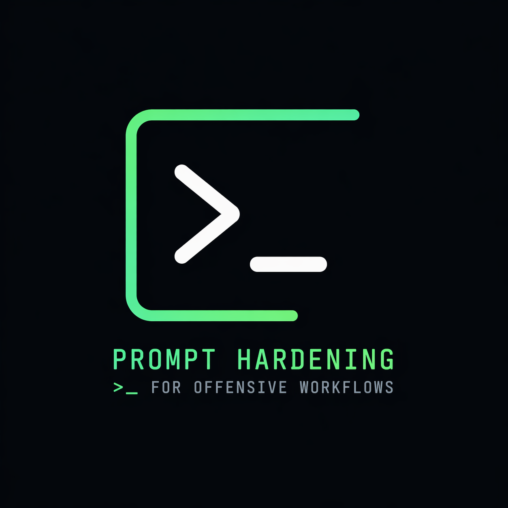

# Prompt Hardening for Offensive Workflows

A Codex Skill that rewrites rough AI prompts used in authorized offensive security workflows to reduce hallucination, constrain assumptions, and keep outputs grounded in observed evidence.

> A prompt “linting” layer for AI-assisted security workflows.

---

## Why this exists

AI is increasingly used in offensive security workflows, but most prompts are:

* too vague
* overly assumptive
* prone to hallucinated conclusions
* not structured for validation

This leads to:

* false positives
* wasted time
* misleading analysis
* overconfident outputs

This project helps operators **engineer their prompts**, not just write them.

---

## What it does

Given a rough prompt, this skill rewrites it to:

* anchor on observed evidence
* prevent assumed authentication or access
* separate facts from inferences and speculation
* enforce scope and authorization constraints
* bias toward minimal, testable validation steps
* require uncertainty to be stated clearly

---

## Phase-Aware Hardening (v2)

This version introduces **automatic phase detection** and adjusts prompt hardening based on the operator’s intent.

The skill infers the testing phase and applies targeted constraints:

### Recon / Enumeration

* focuses on surface discovery and organization
* avoids premature vulnerability claims
* prioritizes structure and visibility gaps

### Validation

* focuses on confirming or refuting hypotheses
* enforces minimal, reproducible test steps
* avoids assumptions of success

### Analysis / Triage

* separates signal from noise
* enforces strict fact vs inference boundaries
* highlights uncertainty and alternative explanations

### Reporting

* ensures claims are backed by evidence
* distinguishes confirmed impact from theoretical risk
* produces concise, defensible outputs

If the phase is unclear, the skill defaults to **Analysis / Triage**.

---

## Example

### Before

What can I do with these endpoints?

### After

Using only the observed endpoints, parameters, and responses provided below, identify plausible security testing directions for an authorized assessment. Do not assume additional routes, authenticated functionality, internal access, or business logic not directly evidenced.

Group your answer into:

1. Observed attack surface
2. Likely validation targets
3. Assumptions requiring confirmation

Prioritize concise, testable next steps and clearly state any uncertainty.

---

## Best used for

* Bug bounty workflows
* Internal authorized testing
* Recon triage
* Web/API analysis
* Findings validation
* Note cleanup

---

## Not for

* Unauthorized testing
* Exploit automation
* Payload generation against real targets

---

## Usage

Provide:

* your rough prompt
* context (optional)
* observed evidence (optional)

The skill returns:

* detected testing phase
* a hardened prompt
* a short explanation of improvements

---

## Philosophy

> AI should assist operators, not mislead them.

This project focuses on:

* signal over noise
* validation over speculation
* control over convenience

---

## License

MIT
